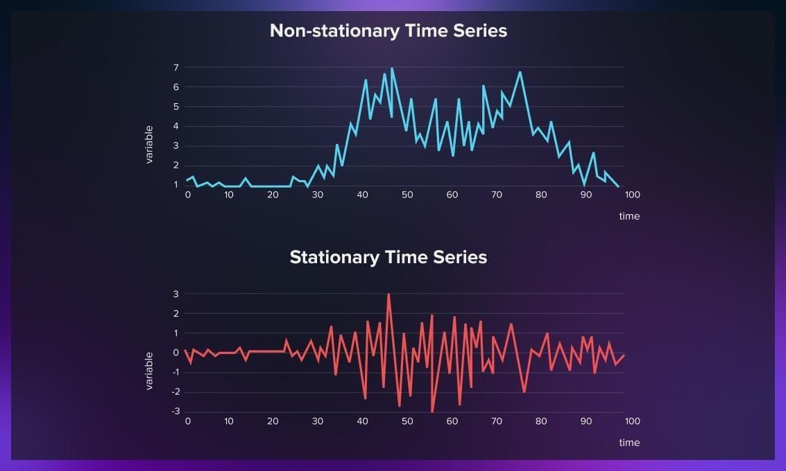

# **Análisis de Series Temporales en el Mercado de Bitcoin (BTC/USD)**

---

## 📌 Objetivo

Analizar la evolución del precio de Bitcoin (BTC/USD) mediante el uso de modelos estadísticos y de aprendizaje profundo para comprender su comportamiento y generar predicciones.

---

## 📂 Estructura del Proyecto
btc-series-tiempo/
- datos/
   - BTC_USD_ALL_20240601.xlsx
- scripts/
   - BTC_experiments.ipynb
- readme.md
- banner.jpg

---

## ⚙️ Tecnologías y Librerías Utilizadas

- Python 3.x  
- pandas, numpy  
- matplotlib, seaborn  
- scikit-learn  
- statsmodels  
- arch  
- keras (con backend de TensorFlow)

---

## 🧪 Metodología

1. **Carga y limpieza de datos**  
   - Lectura desde Excel  
   - Conversión de fechas y estandarización de decimales  
   - Revisión y manejo de valores faltantes  

2. **Análisis exploratorio**  
   - Visualización de precios históricos  
   - Estadísticas descriptivas  
   - Observación de tendencias y volatilidad  

3. **Modelado**  
   - **ARIMA**: captura de la estructura temporal  
   - **GARCH**: modelado de la volatilidad  
   - **LSTM**: red neuronal recurrente para patrones no lineales  

4. **Evaluación de modelos**  
   - Predicciones y comparación con valores reales  
   - Métricas de error como MAE y RMSE  
   - Visualización del desempeño de cada modelo  

---

## 📊 Resultados Destacados

- **ARIMA** logra capturar patrones lineales, pero se ve limitado frente a movimientos abruptos.  
- **GARCH** modela correctamente la volatilidad condicional.  
- **LSTM** muestra buen potencial para captar dinámicas complejas, aunque su rendimiento puede mejorar con más datos y ajuste de hiperparámetros.

---

## 🚀 Cómo Ejecutar el Proyecto

1. Clonar el repositorio:
git clone https://github.com/tuusuario/btc-series-tiempo.git
cd btc-series-tiempo

2. Instalar dependencias necesarias:
pip install pandas matplotlib seaborn numpy scikit-learn statsmodels arch keras

3. Ejecutar la notebook:

Abrir `BTC_experiments.ipynb` con Jupyter Notebook, JupyterLab o VSCode.

---

## 📝 Licencia

Este proyecto fue realizado con fines académicos.  
No representa asesoramiento financiero.

---
